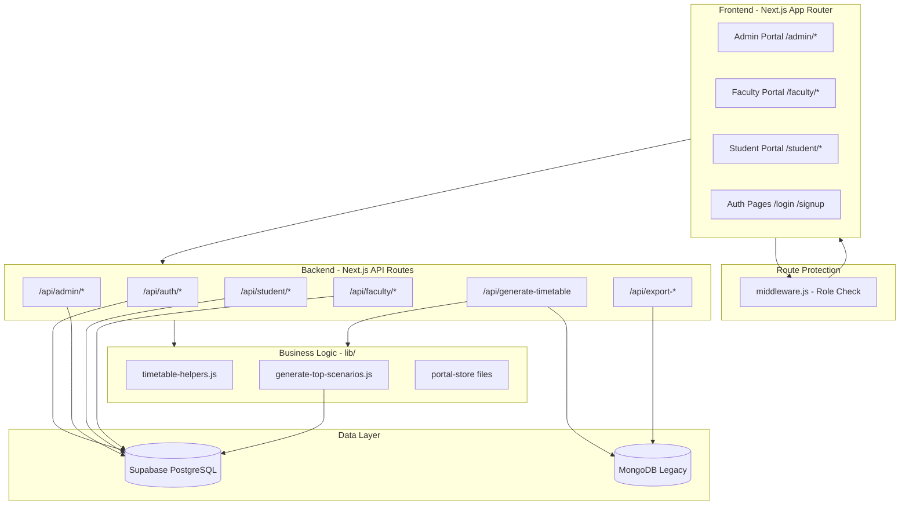
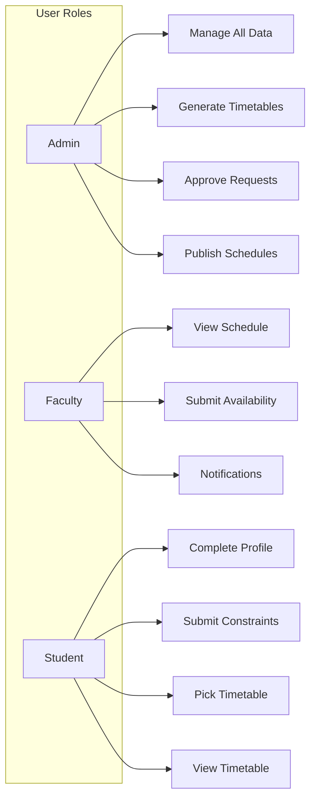
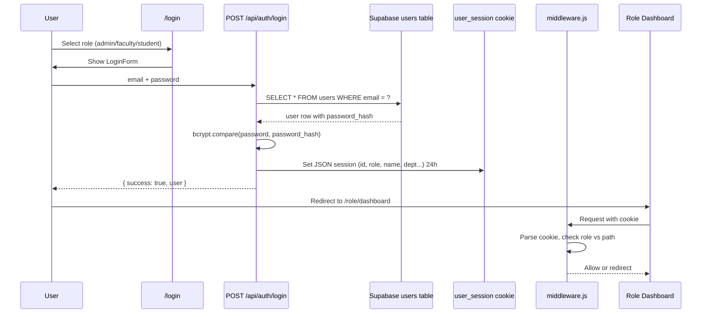
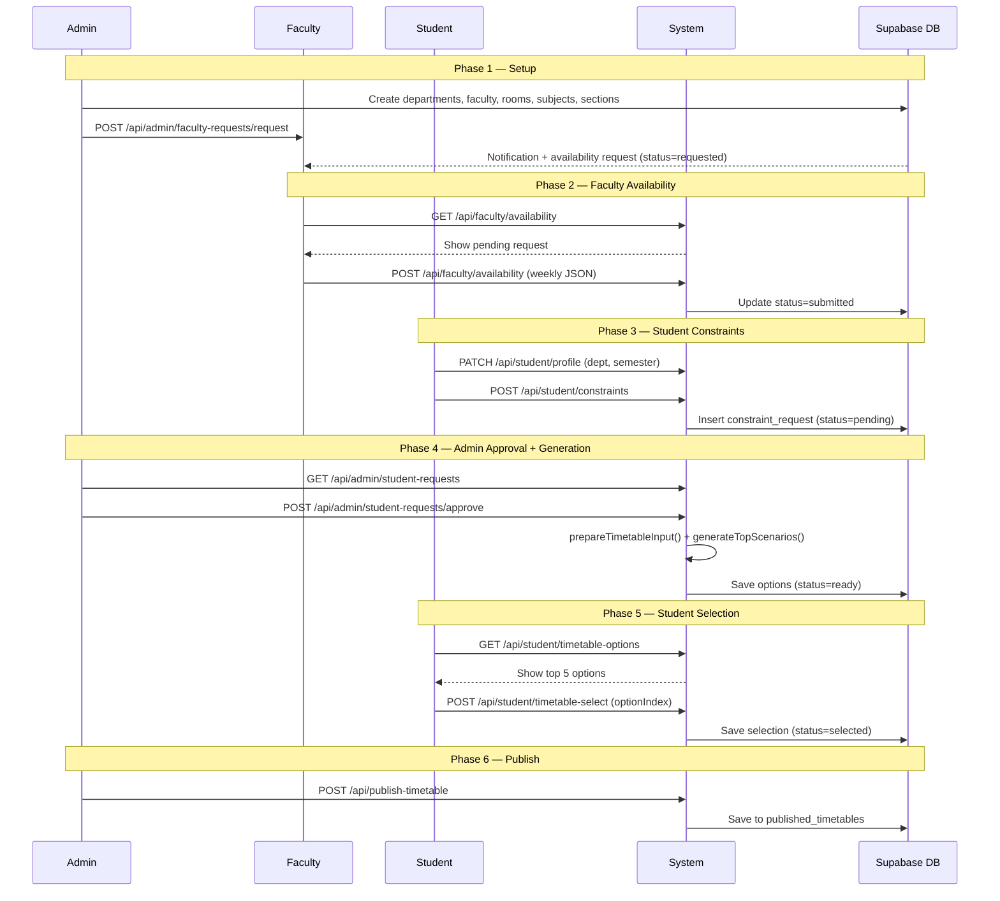
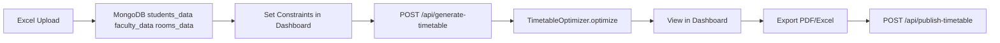
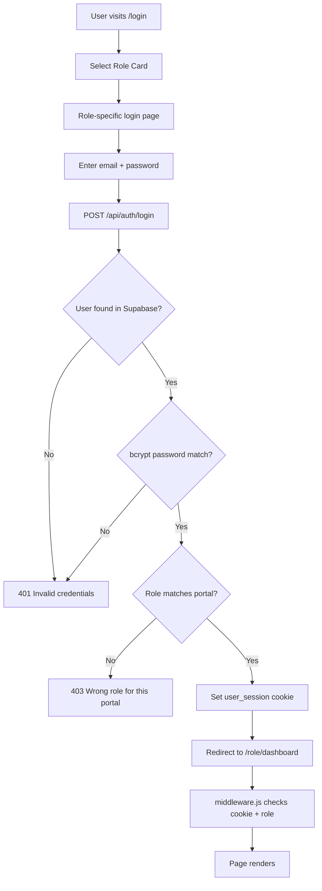

# SmartScheduler.AI — Complete Viva Script

> **Bilingual viva preparation document** — Roman Urdu explanations + English technical terms  
> **Format:** Part A (bolne wali script) + Part B (detailed reference notes) + Q&A + Cheat Sheet

---

# PART A — SPOKEN SCRIPT (5–10 Minutes)

*Ye lines examiner ke saamne seedha bol sakte ho. Technical terms English mein rakhe gaye hain.*

---

## A1. Opening / Introduction (1 minute)

> "Assalam-o-Alaikum / Good morning, respected panel members.

> Mera naam **[apna naam]** hai. Main aaj apna Final Year Project present kar raha/rahi hoon.

> Mera project ka naam hai **SmartScheduler.AI** — yeh ek **AI-powered intelligent scheduling system** hai jo educational institutions ke liye banaya gaya hai.

> Is project ka maqsad hai ke universities aur colleges mein **timetable generation** ko automate karna — jahan pehle manually schedule banana bahut mushkil hota tha: faculty clashes, room capacity issues, student preferences, aur NEP 2020 ke multidisciplinary requirements sab ek saath handle karna zaroori hai.

> Humne is problem ka solution ek **Genetic Algorithm** based optimizer aur ek **three-role web portal** — Admin, Faculty, aur Student — ke zariye diya hai."

---

## A2. Problem Statement (1 minute)

> "Problem yeh hai ke **timetabling** ek **NP-hard combinatorial optimization problem** hai.

> Matlab: agar aap ke paas 20 faculty, 10 rooms, 15 subjects, aur 8 sections hain, to possible combinations ki taadaad **billions** mein chali jaati hai. Brute force se har combination check karna practically impossible hai.

> Manual scheduling mein yeh issues aate hain:
> - **Faculty double-booking** — ek teacher do jagah ek hi time par
> - **Room over-capacity** — choti room mein zyada students
> - **Student gaps** — classes ke beech lambi khaliyan
> - **Faculty workload imbalance** — kuch teachers overloaded, kuch free
> - **Student preferences ignore** — students ki timing preferences consider nahi hoti

> Is liye humne AI-based automated solution banaya."

---

## A3. Solution Overview (1.5 minutes)

> "Hamara solution do hisson par based hai:

> **Pehla hissa — AI Optimization Engine:**
> Humne custom **Genetic Algorithm** implement kiya hai jo random timetables ki **population** banata hai, unhe **fitness function** se score karta hai, aur **20 generations** tak evolve karta hai jab tak best valid schedule na mil jaye.

> **Dusra hissa — Three-Role Web Portal:**
> - **Admin** — departments, faculty, rooms, subjects manage karta hai; timetable generate karta hai; student requests approve karta hai
> - **Faculty** — apni weekly **availability** submit karta hai (kis din, kis time available hain)
> - **Student** — apni **scheduling constraints** submit karta hai (preferred times, gap avoidance); phir AI-generated **top 5 options** mein se apna timetable choose karta hai

> **Tech stack:** Next.js 14 full-stack framework, React 18 UI, Supabase PostgreSQL database, bcrypt authentication, aur Tailwind CSS + Shadcn UI components."

---

## A4. Live Demo Narration (3–4 minutes)

*Demo ke dauran ye lines follow karo:*

> "Ab main live demo dikhata/dikhati hoon.

> **Step 1 — Login:** `http://localhost:3000/login` par jaate hain. Teen roles hain: Admin, Faculty, Student. Main Admin se login karta/karti hoon — email: `admin@smartscheduler.com`, password: `admin123`.

> **Step 2 — Admin Dashboard:** Yahan admin ko poora control milta hai — data upload, AI generation, schedule view, aur settings. Sidebar se Departments, Faculty, Rooms, Subjects, Sections manage kar sakte hain.

> **Step 3 — Faculty Availability:** Admin **Faculty Requests** page par ja kar semester aur department select karke sab faculty ko availability request bhejta hai. Faculty login karke apni weekly availability submit karta hai — kis din available hain, kis time se kis time tak.

> **Step 4 — Student Constraints:** Student signup/login karke apna profile complete karta hai — department aur semester select karta hai. Phir **Constraints** page par apni preferences submit karta hai — jaise minimum break time, gap avoidance, preferred time slots.

> **Step 5 — Admin Approval:** Admin **Student Requests** page par ja kar pending requests dekhta hai aur **Approve All** click karta hai. System automatically har student ke liye **Genetic Algorithm** chalata hai aur **top 5 unique timetable options** generate karta hai.

> **Step 6 — Student Selection:** Student **Pick Timetable** page par ja kar 5 options compare karta hai, preview dekhta hai, aur apna favourite select karta hai.

> **Step 7 — Export:** Admin final schedule ko **PDF** ya **Excel** mein export kar sakta hai aur publish kar sakta hai."

---

## A5. Closing Statement (30 seconds)

> "To summarize: SmartScheduler.AI ek complete end-to-end solution hai jo manual timetable ki problems ko AI optimization se solve karta hai, aur teen stakeholders — Admin, Faculty, Student — ko dedicated portals deta hai.

> Yeh project **NEP 2020** ke multidisciplinary education vision se aligned hai aur originally **Smart India Hackathon 2024** ke liye develop hua tha.

> Main ab aap ke questions ka jawab dene ke liye tayyar hoon. Shukriya."

---

---

# PART B — DETAILED REFERENCE NOTES

---

## Section 1: Project Identity

| Field | Value |
|-------|-------|
| **Project Name** | SmartScheduler.AI |
| **npm Package** | `smartscheduler-ai` |
| **Version** | 1.0.0 |
| **Tagline** | Intelligent scheduling system powered by AI for educational institutions |
| **Origin** | Smart India Hackathon (SIH) 2024 |
| **License** | MIT |
| **Alignment** | NEP 2020 — multidisciplinary education scheduling |

### Kya hai yeh project?

SmartScheduler.AI ek **web-based academic timetable management system** hai jo:
1. **AI (Genetic Algorithm)** se conflict-free timetables generate karta hai
2. **Three user roles** (Admin, Faculty, Student) ko alag portals deta hai
3. **Constraints** (hard + soft) handle karta hai
4. **PDF/Excel export** aur publish functionality provide karta hai
5. **Android APK** bhi support karta hai (Capacitor ke through)

### Problem kya solve karta hai?

Universities mein har semester timetable manually banana:
- Time-consuming (weeks lag sakte hain)
- Error-prone (clashes miss ho jaate hain)
- Inflexible (changes mushkil)
- Student/faculty preferences ignore hoti hain

Hamara system yeh sab automate karta hai minutes mein.

---

## Section 2: System Architecture

### Architecture Diagram



### Architecture Explain (Viva ke liye)

**1. Frontend Layer (Next.js App Router)**
- `app/` folder mein sab pages aur API routes ek hi project mein hain
- **App Router** — Next.js 13+ ka naya routing system; har folder ek route hai
- Client-side pages `'use client'` directive use karti hain (interactive UI)
- Server components bhi supported hain (e.g., `app/page.js` redirect)

**2. Middleware Layer**
- `middleware.js` — har request se pehle chalta hai
- `user_session` cookie check karta hai
- Role-based access control: `/admin` sirf admin, `/faculty` faculty/admin, `/student` student/admin

**3. API Layer (Next.js API Routes)**
- `app/api/` folder mein har subfolder ek REST endpoint hai
- Har `route.js` file HTTP methods export karti hai: `GET`, `POST`, `PUT`, `DELETE`
- Server-side code — database access, business logic

**4. Business Logic Layer (`lib/`)**
- Reusable functions jo API routes aur pages dono use kar sakte hain
- Database helpers, constraint rules, optimization orchestration

**5. Data Layer (Dual Database)**
- **Supabase (PostgreSQL)** — Primary: users, departments, rooms, subjects, sections, student/faculty portal tables
- **MongoDB** — Legacy: Excel uploads, bulk generation results, exports, published timetables
- Migration in progress — naye features Supabase use karte hain

### Request Flow Example

```
Browser → localhost:3000/admin/dashboard
    ↓
middleware.js → cookie check → role = admin? → allow
    ↓
app/admin/dashboard/page.js → React render
    ↓
User clicks "Generate Timetable"
    ↓
POST /api/generate-timetable
    ↓
TimetableOptimizer.optimize() → Genetic Algorithm
    ↓
Response JSON → UI update
```

### Key Architecture Files

| File | Path | Kya karta hai |
|------|------|---------------|
| Root Layout | `app/layout.js` | Global HTML shell, metadata, CSS import |
| Root Page | `app/page.js` | `/` → redirect to `/login` |
| Middleware | `middleware.js` | Session + role-based route protection |
| Supabase Client | `lib/supabase.js` | Database connection (browser + server clients) |
| Next Config | `next.config.js` | Standalone output, CORS headers, security |

---

## Section 3: Technology Stack (Har cheez kya hai + kyun use ki)

### Complete Stack Table

| Layer | Technology | Version | Kya hai | Kyun use ki |
|-------|-----------|---------|---------|-------------|
| **Framework** | Next.js | 14.2.3 | React-based full-stack framework | Single repo mein frontend + backend; SSR support; Vercel par easy deploy; App Router |
| **UI Library** | React | 18 | Component-based UI library | Industry standard; reusable components; virtual DOM |
| **Styling** | Tailwind CSS | 3.4 | Utility-first CSS framework | Fast styling; consistent design; responsive |
| **UI Components** | Radix UI + Shadcn | — | Accessible headless primitives | Pre-built accessible dialogs, tabs, selects; `components/ui/` |
| **Icons** | Lucide React | — | SVG icon library | Clean, consistent icons |
| **Forms** | React Hook Form + Zod | — | Form handling + validation | Type-safe validation; less re-renders |
| **Tables** | TanStack React Table | — | Data table library | Sorting, filtering, pagination in admin pages |
| **Charts** | Recharts | — | Chart library | Admin reports mein utilization graphs |
| **Toasts** | Sonner | — | Toast notifications | User feedback (success/error messages) |
| **Database (Primary)** | Supabase (PostgreSQL) | — | Cloud relational database | Structured data (departments→subjects→sections); SQL joins; Row Level Security |
| **Database (Legacy)** | MongoDB | 6.6 | Document database | Original demo pipeline; Excel data storage; flexible schema |
| **DB Client** | @supabase/supabase-js | 2.107 | Supabase JavaScript SDK | Easy CRUD; real-time subscriptions; auth integration |
| **Password Hash** | bcryptjs | — | Password hashing library | Passwords plain text mein store nahi; 10 salt rounds |
| **Session Auth** | Cookie (`user_session`) | — | HTTP cookie-based session | Browser mein session maintain; 24 hour expiry |
| **JWT Auth** | jsonwebtoken | — | JSON Web Token | Legacy Mongo API routes ke liye Bearer token |
| **AI Engine** | Custom Genetic Algorithm | — | Population-based optimizer | NP-hard timetabling; brute force impossible; evolves solutions |
| **PDF Export** | jsPDF + Puppeteer | — | PDF generation | Server-side PDF rendering; printable timetables |
| **Excel** | xlsx (SheetJS) | — | Excel read/write | Admin data upload; timetable export |
| **File Upload** | multer + react-dropzone | — | File handling | Excel file upload in admin dashboard |
| **Mobile** | Capacitor | 7 | Web-to-native wrapper | Same web app ko Android APK mein wrap |
| **Deployment** | Vercel | — | Cloud hosting | Zero-config Next.js deploy; auto SSL |
| **CI/CD** | GitHub Actions | — | Automated testing | Push par build + test run |
| **Runtime** | Node.js | 18+ | JavaScript runtime | Server-side execution |

### Environment Variables (`.env.local`)

| Variable | Required? | Kya hai | Example |
|----------|-----------|---------|---------|
| `NEXT_PUBLIC_SUPABASE_URL` | Yes | Supabase project URL | `https://xxx.supabase.co` |
| `NEXT_PUBLIC_SUPABASE_ANON_KEY` | Yes | Public API key (browser) | `eyJhbG...` |
| `SUPABASE_SERVICE_ROLE_KEY` | Yes | Server-side full access key | `eyJhbG...` |
| `SUPABASE_DB_PASSWORD` | For schema scripts | Direct Postgres password | `your-db-password` |
| `DATABASE_URL` | Alternative | Full Postgres connection URI | `postgresql://postgres:...` |
| `JWT_SECRET` | Yes | JWT signing secret | Random 32+ char string |
| `CORS_ORIGINS` | Yes | Allowed origins | `http://localhost:3000` |
| `NODE_ENV` | Yes | Environment mode | `development` / `production` |
| `MONGO_URL` | Legacy only | MongoDB connection string | `mongodb://localhost:27017` |
| `DB_NAME` | Legacy only | MongoDB database name | `smartscheduler` |
| `CAPACITOR_SERVER_URL` | Android | URL loaded in native shell | `http://192.168.1.10:3000` |

### npm Scripts

| Script | Command | Kya karta hai |
|--------|---------|---------------|
| `npm run dev` | `next dev --hostname 0.0.0.0 --port 3000` | Development server start (port 3000) |
| `npm run build` | `next build` | Production build banata hai |
| `npm start` | `next start` | Production server chalata hai |
| `npm run lint` | `next lint` | Code quality check (ESLint) |
| `npm run db:student-portal` | `node scripts/run-student-portal-schema.mjs` | Student portal tables create karta hai |
| `npm run db:faculty-portal` | `node scripts/run-faculty-portal-schema.mjs` | Faculty portal tables create karta hai |
| `npm run android:apk:debug` | Gradle assembleDebug | Android debug APK banata hai |

---

## Section 4: User Roles & Portals

### Teen Roles Overview



---

### 4.1 Admin Portal (`/admin/*`)

**Login:** `admin@smartscheduler.com` / `admin123`  
**Entry:** `/admin/dashboard`  
**Layout:** `AdminSidebar` component — left sidebar navigation

#### Admin Pages — Har page kya karta hai

| Page | URL | Kya display hota hai | Key Functionality |
|------|-----|---------------------|-------------------|
| **Dashboard Hub** | `/admin/dashboard` | Multi-section hub with sidebar tabs | Data upload (Excel), AI generation, schedule view, settings — sab ek page mein |
| **Departments** | `/admin/departments` | Department list + stats cards | CRUD: name, code — via `/api/admin/departments` |
| **Faculty** | `/admin/faculty` | Faculty table with department filter | CRUD: name, email, password, department — via `/api/admin/faculty` |
| **Rooms** | `/admin/rooms` | Room inventory with type/capacity | CRUD: name, building, type (classroom/lab/seminar), capacity — via `/api/admin/rooms` |
| **Subjects** | `/admin/subjects` | Course catalog | CRUD: name, code, credit_hours, department — via `/api/admin/subjects` |
| **Sections** | `/admin/sections` | Class sections/batches | CRUD: name, semester, department, student_count — via `/api/admin/sections` |
| **Student Requests** | `/admin/student-requests` | Student constraint submissions | List by status; **Approve All** → triggers top-5 generation per student |
| **Faculty Requests** | `/admin/faculty-requests` | Faculty availability workflow | Send bulk availability requests; track submitted/pending |
| **Constraints** | `/admin/constraints` | System-wide scheduling rules | Hard constraints (fixed) + soft constraints (weighted sliders); saved to `localStorage` |
| **Emergency Update** | `/admin/emergency-update` | Emergency scheduling changes | Teacher leave or room unavailable with date range |
| **Reports** | `/admin/reports` | Analytics dashboard | Faculty/room utilization charts (partially demo data) |

#### Admin Dashboard Internal Sections (query param `?page=`)

| Section | Kya karta hai |
|---------|---------------|
| `dashboard` | Welcome card, quick action buttons, metrics (departments, faculty, rooms count) |
| `data` | Excel file upload (students/faculty/rooms); inline CRUD tables |
| `generate` | Department/semester filter; hard/soft constraints; AI generate button → `/api/generate-timetable` |
| `view` | Section-wise timetable grid; export Excel/PDF; publish button |
| `settings` | Admin profile, password change, notification preferences |

---

### 4.2 Faculty Portal (`/faculty/dashboard`)

**Login:** `faculty@smartscheduler.com` / `faculty123` (ya name se bhi login ho sakta hai)  
**Entry:** `/faculty/dashboard`  
**Layout:** Single-page SPA with internal tab navigation (purple theme)

#### Faculty Views — Har view kya karta hai

| View | Kya display hota hai | Key Functionality |
|------|---------------------|-------------------|
| **Dashboard** | Welcome card, course/class stats, weekly preview | Overview stats (currently sample data) |
| **My Timetable** | Full weekly schedule table | Assigned classes list (currently sample data) |
| **My Availability** | Per-day enable/disable toggles + time pickers | Submit weekly availability → `POST /api/faculty/availability` |
| **Notifications** | Notification cards (success/warning/info) | Alerts about availability requests, schedule changes |
| **Profile** | Phone number field, save button | Profile update (toast feedback) |

**Faculty Availability Flow:**
1. Admin sends request → `faculty_availability_requests` table mein `status = 'requested'`
2. Faculty opens Availability view → request dikhta hai
3. Faculty har din ke liye available hours set karta hai (JSON format)
4. Submit → `status = 'submitted'`, `submitted_at` timestamp set
5. Admin student requests approve karte waqt yeh availability optimizer mein use hoti hai

---

### 4.3 Student Portal (`/student/*`)

**Login:** `student@smartscheduler.com` / `student123`  
**Signup:** `/signup/student` — 2-step: account info → department/semester  
**Layout:** `StudentPortalShell` component (navy/gold university theme)

#### Student Pages — Har page kya karta hai

| Page | URL | Kya display hota hai | Key Functionality |
|------|-----|---------------------|-------------------|
| **Onboarding** | `/student/onboarding` | Department + semester form | Profile completion → `PATCH /api/student/profile` → redirect to constraints |
| **Dashboard** | `/student/dashboard` | Stats, quick links, constraint status | Sub-views via hash: `#timetable`, `#notifications`, `#profile` |
| **Constraints** | `/student/constraints` | Scheduling preference form with help UI | Soft constraints submit → `POST /api/student/constraints`; status-driven CTA |
| **Pick Timetable** | `/student/pick-timetable` | Top 5 AI-generated options with preview | Compare scenarios → select one → `POST /api/student/timetable-select` |

#### Student Dashboard Sub-Views (hash navigation)

| Hash | Kya display hota hai |
|------|---------------------|
| `#timetable` (default) | Weekly grid + class list from selected timetable |
| `#notifications` | Notification list from `/api/student/notifications` |
| `#profile` | Student info, notification toggles, phone update |

#### Student Constraint Options (kya submit kar sakta hai)

- Minimum break between classes
- Avoid long walking distances between rooms
- Preferred morning/afternoon slots
- Minimize gaps in schedule
- Balanced daily workload

---

### 4.4 Authentication Flow (Detail)



#### Auth Files

| File | Kya karta hai |
|------|---------------|
| `app/login/page.js` | Role selection screen (3 cards) |
| `app/login/admin/page.js` | Admin login form |
| `app/login/faculty/page.js` | Faculty login (email OR name) |
| `app/login/student/page.js` | Student login form |
| `components/auth/LoginForm.js` | Shared form component with role validation |
| `components/auth/RoleSelectScreen.js` | Role picker cards UI |
| `components/auth/AuthShell.js` | Split-panel auth layout |
| `app/api/auth/login/route.js` | Login API — Supabase lookup + bcrypt verify + cookie set |
| `app/api/auth/logout/route.js` | Clears `user_session` cookie |
| `app/api/auth/check-session/route.js` | Returns current session from cookie |
| `lib/auth-session.js` | `getSessionUser()` — parses cookie in API routes |
| `lib/auth-middleware.js` | JWT `verifyToken`, `createToken`, `withAuth` wrapper |
| `middleware.js` | Route-level protection before page render |

#### Session Cookie Details

```javascript
// Cookie name: user_session
// Format: JSON string
{
  id: "uuid",
  name: "Admin User",
  email: "admin@smartscheduler.com",
  role: "admin",
  department_id: "uuid-or-null",
  department_name: "Computer Science",
  department_code: "CS"
}
// maxAge: 24 hours (86400 seconds)
// httpOnly: false (client JS can read)
// sameSite: lax
```

#### Role Access Matrix

| Path Prefix | Allowed Roles |
|-------------|---------------|
| `/admin/*` | `admin` only |
| `/faculty/*` | `faculty`, `admin` |
| `/student/*` | `student`, `admin` |
| `/login`, `/signup` | Everyone (public) |
| `/api/*` | No middleware block (API handles own auth) |

---

## Section 5: Database Schema

### Database Type: Supabase (PostgreSQL)

**Connection:** `lib/supabase.js` — do clients:
- `supabaseClient` — browser-side, anon key (limited access)
- `supabaseServer` — server-side, service role key (full access, API routes mein use)

**Schema files:**
- `lib/schema.sql` — main schema (core + student portal + faculty portal tables)
- `lib/student-portal-schema.sql` — student portal tables only (idempotent)
- `lib/faculty-portal-schema.sql` — faculty availability requests only (idempotent)

### ENUM Types

| ENUM | Values | Kahan use hota hai |
|------|--------|-------------------|
| `user_role` | admin, faculty, student | `users.role` column |
| `room_type` | classroom, lab, seminar_hall | `rooms.type` column |
| `availability_status` | available, occupied, maintenance | `rooms.availability_status` |
| `constraint_request_status` | pending, approved, ready, selected, error | `student_constraint_requests.status` |
| `faculty_availability_status` | requested, submitted, approved | `faculty_availability_requests.status` |

### Core Tables

| Table | Columns (key) | Kya store karta hai | Relations |
|-------|----------------|---------------------|-----------|
| **departments** | id, name, code | Academic departments (CS, EE, etc.) | Parent of users, subjects, sections |
| **users** | id, email, password_hash, role, name, phone, department_id | Sab accounts — admin, faculty, student | FK → departments |
| **rooms** | id, name, type, capacity, building, availability_status | Physical classrooms, labs, seminar halls | Used in timetable_slots |
| **subjects** | id, name, code, credit_hours, department_id | Courses/subjects per department | FK → departments |
| **sections** | id, name, semester, department_id, student_count | Student groups/batches (e.g., "CS-3A") | FK → departments |
| **faculty_availability** | id, faculty_id, day_of_week, is_available | Legacy per-day availability flags | FK → users |
| **timetable_slots** | id, section_id, subject_id, faculty_id, room_id, day_of_week, start_time, end_time, semester | Published schedule slots | FK → sections, subjects, users, rooms |
| **notifications** | id, user_id, title, message, is_read | In-app alerts per user | FK → users |

### Student Portal Tables

| Table | Columns (key) | Kya store karta hai | Status Flow |
|-------|----------------|---------------------|-------------|
| **student_profiles** | id, user_id, department_id, semester, profile_complete | Student academic info | One per student |
| **student_constraint_requests** | id, user_id, semester, constraints (JSONB), status | Student scheduling preferences | pending → approved → ready → selected |
| **student_timetable_options** | id, user_id, request_id, options (JSONB) | Top 5 AI-generated timetables | Created after approval |
| **student_selected_timetables** | id, user_id, option_index, timetable (JSONB) | Student's final chosen timetable | Created on selection |

**Student Constraint Request Status Flow:**
```
pending    → Student ne submit kiya, admin review pending
approved   → Admin ne approve kiya, generation start hui
ready      → Top 5 options generate ho gaye, student pick kar sakta hai
selected   → Student ne apna option choose kar liya
error      → Generation fail hui (faculty availability missing, etc.)
```

### Faculty Portal Tables

| Table | Columns (key) | Kya store karta hai | Status Flow |
|-------|----------------|---------------------|-------------|
| **faculty_availability_requests** | id, user_id, department_id, semester, availability (JSONB), status | Weekly availability per faculty | requested → submitted → approved |

**Faculty Availability JSON Format (example):**
```json
{
  "Monday": { "enabled": true, "from": "09:00", "to": "17:00" },
  "Tuesday": { "enabled": true, "from": "09:00", "to": "15:00" },
  "Wednesday": { "enabled": false },
  "Thursday": { "enabled": true, "from": "10:00", "to": "16:00" },
  "Friday": { "enabled": true, "from": "09:00", "to": "13:00" }
}
```

### Row Level Security (RLS)

- Har table par `ENABLE ROW LEVEL SECURITY` set hai
- Policies define karti hain ke kaun kya dekh/sakta hai
- API routes `supabaseServer` (service role) use karte hain jo RLS bypass karta hai
- Future mein client-side direct access ke liye proper user-scoped policies add ho sakti hain

### Indexes (Performance)

Schema mein indexes hain frequently queried columns par:
- `idx_users_email`, `idx_users_role`, `idx_users_department`
- `idx_sections_semester`, `idx_sections_department`
- `idx_timetable_slots_faculty`, `idx_timetable_slots_day`
- `idx_student_constraint_requests_status`
- `idx_faculty_availability_requests_status`

---

## Section 6: API Routes (Complete Reference)

### 6.1 Authentication APIs (`/api/auth/`)

| Route | Method | Input | Output | Database |
|-------|--------|-------|--------|----------|
| `/api/auth/login` | POST | `{ email, password }` | `{ success, user }` + sets cookie | `users` (Supabase) |
| `/api/auth/logout` | POST | — | Clears `user_session` cookie | — |
| `/api/auth/check-session` | GET | Cookie | `{ user }` or 401 | Cookie parse |
| `/api/auth/signup` | POST | `{ name, email, password, role }` | `{ success, user, token }` | `users` (Supabase) |
| `/api/auth/student-signup` | POST | `{ name, email, password, department_id, semester }` | `{ success, user }` | `users` + `student_profiles` |
| `/api/auth/faculty-signup` | POST | `{ name, email, password, department_id, designation }` | `{ success, user }` | `users` |
| `/api/auth/seed` | GET | — | Creates demo users | `users` (admin, faculty, student) |

### 6.2 Admin APIs (`/api/admin/`)

| Route | Method | Input | Output | Database |
|-------|--------|-------|--------|----------|
| `/api/admin/departments` | GET | — | `[{ id, name, code, counts }]` | `departments` |
| `/api/admin/departments` | POST | `{ name, code }` | `{ id, name, code }` | `departments` |
| `/api/admin/departments` | PUT | `{ id, name, code }` | Updated row | `departments` |
| `/api/admin/departments` | DELETE | `?id=uuid` | Success | `departments` |
| `/api/admin/faculty` | GET/POST/PUT/DELETE | Faculty CRUD fields | Faculty rows | `users` (role=faculty) |
| `/api/admin/rooms` | GET/POST/PUT/DELETE | Room CRUD fields | Room rows | `rooms` |
| `/api/admin/subjects` | GET/POST/PUT/DELETE | Subject CRUD fields | Subject rows | `subjects` |
| `/api/admin/sections` | GET/POST/PUT/DELETE | Section CRUD fields | Section rows | `sections` |
| `/api/admin/stats` | GET | — | `{ departments, faculty, rooms, sections, slots }` counts | Multiple tables |
| `/api/admin/seed-all` | GET | — | Seeds all tables from `lib/seed-data.js` | All core tables |
| `/api/admin/student-requests` | GET | `?status=pending` | `[{ id, user, constraints, status }]` | `student_constraint_requests` |
| `/api/admin/student-requests/approve` | POST | — | Approves all pending; generates top 5 per student | Multiple tables |
| `/api/admin/faculty-requests` | GET | `?status=`, `?semester=` | `[{ id, user, availability, status }]` | `faculty_availability_requests` |
| `/api/admin/faculty-requests/request` | POST | `{ department_id, semester }` | Creates requests for all faculty + notifications | `faculty_availability_requests` + `notifications` |

### 6.3 Student Portal APIs (`/api/student/`)

| Route | Method | Input | Output | Database |
|-------|--------|-------|--------|----------|
| `/api/student/profile` | GET | Cookie (student) | `{ profile, user }` | `student_profiles` + `users` |
| `/api/student/profile` | PATCH | `{ department_id, semester }` | Updated profile | `student_profiles` |
| `/api/student/constraints` | GET | Cookie (student) | `{ request, constraints }` | `student_constraint_requests` |
| `/api/student/constraints` | POST | `{ constraints: {...} }` | `{ id, status: 'pending' }` | `student_constraint_requests` |
| `/api/student/timetable-options` | GET | Cookie (student) | `{ request, options, selected }` | `student_timetable_options` + `student_selected_timetables` |
| `/api/student/timetable-select` | POST | `{ optionIndex: 0-4 }` | `{ success, timetable }` | `student_selected_timetables`; status → `selected` |
| `/api/student/notifications` | GET | Cookie (student) | `[{ id, title, message, is_read }]` | `notifications` |
| `/api/student/notifications` | PATCH | `{ id }` | Marks notification read | `notifications` |

### 6.4 Faculty Portal APIs (`/api/faculty/`)

| Route | Method | Input | Output | Database |
|-------|--------|-------|--------|----------|
| `/api/faculty/availability` | GET | Cookie (faculty) | `{ request, availability, status }` | `faculty_availability_requests` |
| `/api/faculty/availability` | POST | `{ availability: {...} }` | `{ success, status: 'submitted' }` | `faculty_availability_requests` |

### 6.5 Timetable Engine APIs

| Route | Method | Input | Output | Database |
|-------|--------|-------|--------|----------|
| `/api/generate-timetable` | POST | `{ students, faculty, rooms, subjects, constraints }` | `{ timetable, fitness, conflicts, scenarios }` | Optional: MongoDB `generated_timetables` |
| `/api/student-timetable` | POST | `{ studentId, constraints }` | `{ timetable }` (in-memory only) | None |
| `/api/timetables` | GET | — | `[{ id, timetable, created_at }]` | MongoDB `generated_timetables` |
| `/api/publish-timetable` | POST | `{ timetableId }` | `{ success }` | MongoDB `published_timetables` |
| `/api/publish-timetable` | GET | — | Active published timetables | MongoDB `published_timetables` |

### 6.6 Data & Export APIs

| Route | Method | Input | Output | Database |
|-------|--------|-------|--------|----------|
| `/api/upload` | POST | FormData (Excel file) + `type` | `{ rows, count }` | MongoDB `{type}_data` |
| `/api/data` | GET/POST/PATCH/PUT/DELETE | `?type=students` + CRUD body | CRUD operations | MongoDB `{type}_data` |
| `/api/export-excel` | POST | `{ timetable }` | Excel file download | Optional Mongo log |
| `/api/export-pdf` | POST | `{ timetable, section }` | PDF file (Puppeteer) | — |
| `/api/export-pdf-simple` | POST | `{ timetable }` | HTML for client-side PDF | — |
| `/api/settings` | GET/PUT/PATCH | Settings object | Admin UI settings | MongoDB `settings` |
| `/api/metrics` | GET | — | `{ students, faculty, rooms }` counts | MongoDB collections |

### 6.7 Utility APIs

| Route | Method | Purpose |
|-------|--------|---------|
| `/api/simple` | GET/POST | Health check + echo |
| `/api/test` | GET | MongoDB connection test |
| `/api/[[...path]]` | GET/POST | Legacy catch-all Mongo API (JWT auth) |

---

## Section 7: AI / Genetic Algorithm (Deep Dive)

### Kya hai Genetic Algorithm?

**Genetic Algorithm (GA)** ek **evolutionary optimization technique** hai jo nature ke natural selection se inspired hai:
- **Population** — multiple candidate solutions (random timetables)
- **Fitness** — har solution ko score (kitna acha hai)
- **Selection** — best solutions survive
- **Reproduction** — naye random solutions generate
- **Evolution** — generations ke baad population improve hoti hai

**Kyun use kiya?** Timetabling **NP-hard** problem hai — brute force impossible. GA efficiently solution space explore karta hai.

### Code Location

| File | Class/Function | Lines |
|------|---------------|-------|
| `app/api/generate-timetable/route.js` | `TimetableOptimizer` class | ~line 54 onwards |
| `app/api/generate-timetable/route.js` | `runOptimization()` export | Used by other modules |
| `lib/timetable-helpers.js` | Constraint rules, mappers | ~787 lines |
| `lib/generate-top-scenarios.js` | `prepareTimetableInput()`, `generateTopScenarios()` | Orchestration |

### Algorithm Steps (Viva mein explain karo)

```
Step 1: INPUT
├── faculty[] — teachers with subjects, max hours, availability
├── students[] — sections with enrolled subjects
├── rooms[] — classrooms with capacity, type
├── subjects[] — courses with credit hours
└── constraints{} — hard + soft rules

Step 2: INITIALIZE POPULATION
├── populationSize = 10 (default) or 4 (fast mode)
└── Generate 10 random timetables

Step 3: FITNESS EVALUATION (har timetable ke liye)
├── Start fitness = 1000
├── Hard violations → -500 per violation
├── Faculty overload → -50 per excess hour
├── Workload imbalance → penalty based on spread
└── Gap violations → penalty based on empty periods

Step 4: SELECTION
├── Sort by fitness (highest first)
├── Keep top 50% with zero hard violations
└── Discard rest

Step 5: REPRODUCTION
├── Fill remaining slots with new random timetables
└── Repeat for generations = 20 (or 10 fast)

Step 6: EARLY STOP
├── If hardViolations = 0 AND fitness >= 1000 AND softViolations = 0
└── Break — optimal found!

Step 7: OUTPUT
├── Best valid timetable
├── Fitness score
└── Conflict report
```

### Fitness Function Detail (`calculateFitness`)

```javascript
// Starting score
let fitness = 1000

// HARD VIOLATIONS — heavy penalty (makes timetable invalid)
fitness -= hardViolations.length * 500

// Faculty overload — teaching more than max hours
if (assignedSlots.length > maxHours) fitness -= 50

// SOFT: Workload balance — spread classes evenly across days
if (balancedWorkload) fitness -= spread * (workloadWeight / 20)

// SOFT: Minimize gaps — penalize empty periods between classes
if (minimizeGaps) fitness -= emptyPeriods * gapsWeight
```

### Hard Constraints (MUST NEVER VIOLATE)

| Rule | Kya check karta hai | Penalty |
|------|---------------------|---------|
| **No Student Clash** | Ek section do classes ek hi time par nahi | Hard violation |
| **No Faculty Clash** | Ek teacher do jagah ek hi time par nahi | Hard violation |
| **No Room Clash** | Ek room do classes ek hi time par nahi | Hard violation |
| **Room Capacity** | Section size <= room capacity | Hard violation |
| **Faculty Availability** | Class sirf tab jab faculty available ho | Hard violation |
| **Max Subjects** | Max 5 subjects per semester | Enforced in credit rules |
| **Max Credits** | Max 18 credit hours per semester | Enforced in credit rules |
| **Max Credit per Subject** | Max 3 credit hours per subject | Enforced in credit rules |

### Soft Constraints (OPTIMIZE WHEN POSSIBLE)

| Constraint | Kya optimize karta hai | Weight (default) |
|------------|------------------------|------------------|
| **Minimize Gaps** | Classes ke beech khaliyan kam karo | 75 |
| **Balanced Workload** | Faculty ko evenly distribute karo | 90 |
| **Preferred Times** | Student ki preferred slots prefer karo | From constraints |
| **Walking Distance** | Nearby rooms prefer karo | From constraints |
| **Lunch Break** | 12-1 PM break ensure karo | Fixed |

### Time Slots (Standard)

```
9:00 - 10:00 AM
10:00 - 11:00 AM
11:00 - 12:00 PM
12:00 - 1:00 PM  (lunch break)
1:00 - 2:00 PM
2:00 - 3:00 PM
3:00 - 4:00 PM
```

### Multi-Scenario Generation (`generate-top-scenarios.js`)

Jab admin student requests approve karta hai:

1. `prepareTimetableInput(departmentId, semester)` — Supabase se data load
2. Faculty availability map merge (`getSubmittedAvailabilityMap`)
3. `generateTopScenarios(input, studentConstraints, count=5)` — optimizer 5 baar chalao
4. Har run unique timetable produce karta hai (fingerprint deduplication)
5. Top 5 options `student_timetable_options.options` JSONB mein save

### CS Department Special Rules (`lib/cs-curriculum.js`)

CS department ke liye fixed curriculum rules:
- Semester-wise fixed subjects (e.g., Sem 1: Programming, Math, Physics)
- Elective slots
- Lab sessions paired with theory
- Section-wise subject mapping

---

## Section 8: Complete Workflows

### Workflow A: End-to-End Student Portal Scheduling



**Step-by-step (Roman Urdu):**

1. **Admin setup karta hai** — departments, faculty, rooms, subjects, sections create
2. **Admin faculty ko availability request bhejta hai** — semester + department select karke
3. **Faculty availability submit karta hai** — har din ke available hours
4. **Student profile complete karta hai** — department + semester
5. **Student constraints submit karta hai** — scheduling preferences
6. **Admin student requests approve karta hai** — "Approve All" button
7. **System Genetic Algorithm chalata hai** — har student ke liye top 5 options
8. **Student apna favourite option select karta hai** — Pick Timetable page
9. **Admin final schedule publish karta hai** — sab students ko visible

---

### Workflow B: Admin Direct Generation (Legacy/Demo)



**Step-by-step:**

1. Admin dashboard → Data Management → Excel upload (students.xlsx, faculty.xlsx, rooms.xlsx)
2. Data MongoDB collections mein save (`students_data`, `faculty_data`, `rooms_data`)
3. Admin constraints set karta hai (max hours, lunch break, gap minimization)
4. "Generate Timetable" click → POST `/api/generate-timetable`
5. Optimizer chalta hai → best timetable return
6. View Schedules tab mein section-wise grid dikhta hai
7. Export PDF ya Excel → download
8. Publish → MongoDB `published_timetables` mein save

---

### Workflow C: Authentication & Session



---

### Workflow D: Faculty Availability Request

| Step | Actor | Action | API/Table | Status Change |
|------|-------|--------|-----------|---------------|
| 1 | Admin | Select dept + semester, click "Send Request" | POST `/api/admin/faculty-requests/request` | Creates rows with `status=requested` |
| 2 | System | Create notification for each faculty | `notifications` table | — |
| 3 | Faculty | Login, open Availability view | GET `/api/faculty/availability` | Shows pending request |
| 4 | Faculty | Set hours per day, click Submit | POST `/api/faculty/availability` | `status=submitted`, `submitted_at=now()` |
| 5 | Admin | View Faculty Requests page | GET `/api/admin/faculty-requests` | See submitted count |
| 6 | Admin | Approve student requests | POST `/api/admin/student-requests/approve` | Uses `getSubmittedAvailabilityMap()` |

---

## Section 9: Key Files & Folder Map

### Project Structure

```
myfyp2026/
├── app/                          # Next.js App Router
│   ├── page.js                   # Root → redirect /login
│   ├── layout.js                 # Global layout + metadata
│   ├── globals.css               # Tailwind + CSS variables
│   ├── login/                    # Auth pages (role select + forms)
│   ├── signup/                   # Registration pages
│   ├── admin/                    # Admin portal pages (10 pages)
│   ├── faculty/                  # Faculty portal (dashboard)
│   ├── student/                  # Student portal (4 pages)
│   └── api/                      # API routes (38 route.js files)
├── components/
│   ├── ui/                       # 48 Shadcn/Radix primitives
│   ├── admin/AdminSidebar.js     # Admin navigation sidebar
│   ├── auth/                     # LoginForm, RoleSelectScreen, AuthShell
│   ├── student/                  # StudentPortalShell, ConstraintHelp, theme
│   └── BrandLogo.js              # Logo + loading screen
├── lib/                          # Business logic
│   ├── supabase.js               # Supabase client (browser + server)
│   ├── supabase-db.js            # CRUD helpers for core tables
│   ├── supabase-helpers.js       # Auth helpers (createUser, bcrypt)
│   ├── auth-session.js           # Cookie session parsing
│   ├── auth-middleware.js        # JWT verify/create
│   ├── timetable-helpers.js      # Constraint rules, mappers (787 lines)
│   ├── generate-top-scenarios.js # Multi-scenario orchestration
│   ├── cs-curriculum.js          # CS department subject rules
│   ├── faculty-portal-store.js   # Faculty availability data access
│   ├── student-portal-store.js   # Student portal data access
│   ├── faculty-data.js           # UCP faculty roster + name login
│   ├── seed-data.js              # Demo seed data
│   ├── mongo.js                  # Legacy MongoDB connector
│   ├── schema.sql                # Full PostgreSQL schema
│   ├── student-portal-schema.sql # Student portal tables
│   ├── faculty-portal-schema.sql # Faculty portal tables
│   └── utils.js                  # cn() classname utility
├── hooks/
│   ├── useStudentSession.js      # Student auth hook
│   └── use-toast.js              # Toast notifications
├── scripts/
│   ├── run-student-portal-schema.mjs  # Apply student schema
│   ├── run-faculty-portal-schema.mjs  # Apply faculty schema
│   └── capacitor-set-dev-url.mjs      # Set LAN IP for Android
├── middleware.js                 # Route protection + role checks
├── next.config.js                # Standalone output, CORS, security
├── tailwind.config.js            # Shadcn theme tokens
├── capacitor.config.js           # Android app config
├── package.json                  # Dependencies + scripts
└── .env.example                  # Environment variable template
```

### Important Files — One-Line Purpose

| File | Purpose |
|------|---------|
| `app/api/generate-timetable/route.js` | **Core AI engine** — TimetableOptimizer class with genetic algorithm |
| `lib/timetable-helpers.js` | **Constraint engine** — hard/soft rules, credit limits, schedule builders |
| `lib/generate-top-scenarios.js` | **Orchestrator** — loads Supabase data, runs optimizer N times for top options |
| `lib/faculty-portal-store.js` | **Faculty data layer** — availability request CRUD + readiness check |
| `lib/student-portal-store.js` | **Student data layer** — profile, constraints, options, selection CRUD |
| `app/api/auth/login/route.js` | **Login handler** — Supabase lookup, bcrypt verify, cookie set |
| `middleware.js` | **Security gate** — session check before every protected page |
| `components/admin/AdminSidebar.js` | **Admin navigation** — links to all admin pages |
| `components/student/StudentPortalShell.js` | **Student layout** — sidebar, header, session management |
| `lib/schema.sql` | **Database blueprint** — all tables, indexes, RLS policies |

---

## Section 10: How to Run & Demo Script

### Prerequisites

- Node.js 18+
- npm
- Supabase account (free tier works)
- Optional: MongoDB for legacy features

### Setup Commands

```bash
# 1. Clone/navigate to project
cd /Users/apple/Desktop/fyp-2026/myfyp2026

# 2. Install dependencies
npm install

# 3. Environment setup
cp .env.example .env.local
# Edit .env.local — fill Supabase URL, keys, JWT_SECRET

# 4. Apply database schemas (Supabase SQL editor or scripts)
npm run db:student-portal
npm run db:faculty-portal
# OR paste lib/schema.sql in Supabase SQL Editor

# 5. Seed demo data (optional)
# Visit: http://localhost:3000/api/auth/seed
# OR: http://localhost:3000/api/admin/seed-all

# 6. Start development server
npm run dev

# 7. Open browser
# http://localhost:3000
```

### Demo Credentials

| Role | Email | Password |
|------|-------|----------|
| Admin | `admin@smartscheduler.com` | `admin123` |
| Faculty | `faculty@smartscheduler.com` | `faculty123` |
| Student | `student@smartscheduler.com` | `student123` |

### Live Demo Script (Click-by-Click)

**Part 1: Admin Setup (2 min)**
1. Open `http://localhost:3000/login`
2. Click "Admin" card → Login with admin credentials
3. Show Dashboard — metrics, quick actions
4. Sidebar → Departments → show list (or create new)
5. Sidebar → Faculty → show faculty list
6. Sidebar → Rooms → show room inventory
7. Sidebar → Subjects → show course catalog
8. Sidebar → Sections → show class sections

**Part 2: Faculty Availability (1 min)**
9. Sidebar → Faculty Requests
10. Select semester + department → "Send Availability Request"
11. Logout → Login as Faculty
12. Click "My Availability" → show request
13. Set hours for each day → Submit
14. Logout

**Part 3: Student Flow (2 min)**
15. Login as Student (or signup new student)
16. If new: Onboarding → select department + semester
17. Go to Constraints → fill preferences → Submit
18. Show status: "Pending admin approval"
19. Logout

**Part 4: Admin Approval + Generation (2 min)**
20. Login as Admin
21. Sidebar → Student Requests
22. Show pending request → Click "Approve All"
23. Wait for generation (may take 10-30 seconds)
24. Status changes to "Ready"
25. Logout

**Part 5: Student Selection (1 min)**
26. Login as Student
27. Go to Pick Timetable (or click CTA from constraints page)
28. Show 5 options with preview
29. Select preferred option → Confirm
30. Dashboard → show selected timetable in weekly grid

**Part 6: Export (30 sec)**
31. Login as Admin
32. Dashboard → View Schedules tab
33. Select section → Show timetable grid
34. Click Export PDF or Export Excel → download

---

## Section 11: Likely Viva Questions + Answers (30+ Q&A)

### Project Overview

**Q1: Aap ka project kya karta hai?**
> SmartScheduler.AI ek AI-powered academic timetable management system hai. Yeh Genetic Algorithm use karke conflict-free schedules generate karta hai aur Admin, Faculty, Student ko alag portals deta hai scheduling workflow manage karne ke liye.

**Q2: Yeh kis problem ko solve karta hai?**
> Universities mein manual timetable banana time-consuming aur error-prone hai. Faculty clashes, room capacity issues, student preferences — yeh sab manually handle karna mushkil hai. Hamara system yeh sab automate karta hai minutes mein.

**Q3: NEP 2020 se kya relation hai?**
> NEP 2020 multidisciplinary education promote karta hai — students multiple subjects across departments lete hain. Hamara system multiple departments, sections, aur cross-department scheduling handle karta hai with flexible constraints.

---

### Technology Choices

**Q4: Next.js kyun choose kiya?**
> Next.js ek full-stack React framework hai — frontend aur backend API routes ek hi project mein. App Router se clean routing milti hai, Vercel par zero-config deploy hota hai, aur SSR bhi supported hai.

**Q5: Supabase kyun use kiya, MongoDB kyun nahi?**
> Timetable data highly relational hai — departments → subjects → sections → faculty → rooms. PostgreSQL joins aur foreign keys iske liye ideal hain. Supabase managed PostgreSQL deta hai with Row Level Security. MongoDB legacy routes mein abhi bhi hai migration ke dauran.

**Q6: Genetic Algorithm kyun, brute force kyun nahi?**
> Timetabling NP-hard problem hai — 20 faculty × 10 rooms × 7 time slots × 5 days = billions of combinations. Brute force practically impossible hai. Genetic Algorithm population-based search se efficiently good solutions dhundta hai.

**Q7: React kyun, plain HTML kyun nahi?**
> React component-based architecture deta hai — reusable UI (buttons, forms, tables). State management se dynamic updates (timetable preview, form validation) easy hain. Industry standard hai with huge ecosystem.

**Q8: Tailwind CSS kyun?**
> Utility-first CSS — fast styling without writing custom CSS files. Consistent design system. Responsive design built-in. Shadcn UI components Tailwind par based hain.

---

### Algorithm & Constraints

**Q9: Genetic Algorithm kaise kaam karta hai?**
> 1) Random timetables ki population banate hain (10 schedules). 2) Har schedule ko fitness function se score karte hain. 3) Top 50% survive karte hain. 4) Baaki ke slots naye random schedules se fill hote hain. 5) 20 generations repeat. 6) Best valid schedule return karte hain.

**Q10: Hard constraints aur soft constraints mein kya farq hai?**
> Hard constraints MUST never violate — faculty double-booking, room over-capacity, faculty unavailable time par class. Soft constraints optimize karte hain jab possible ho — minimize gaps, balance workload, preferred times. Hard violation = invalid timetable. Soft violation = lower fitness score.

**Q11: Fitness function kya hai?**
> Fitness ek score hai jo batata hai timetable kitna acha hai. Start 1000 se. Hard violations = -500 each. Faculty overload = -50. Gap violations = -75 per empty period. Workload imbalance = penalty. Higher fitness = better schedule.

**Q12: NP-hard problem kya hai?**
> NP-hard means problem ka solution verify karna easy hai but find karna exponentially hard hai. Timetabling mein possible combinations factorial growth karte hain. Is liye heuristic algorithms (like GA) use karte hain jo "good enough" solution efficiently dhundte hain.

**Q13: Credit hour rules kya hain?**
> Max 5 subjects per semester. Max 18 total credit hours per semester. Max 3 credit hours per individual subject. Yeh rules `applySemesterCreditRules()` function enforce karta hai before generation.

---

### Authentication & Security

**Q14: Authentication kaise implement hai?**
> Email + password login. Password bcrypt se hash hota hai (10 salt rounds) — plain text store nahi hota. Login successful → `user_session` cookie set (JSON user object, 24h expiry). Middleware har request par cookie check karta hai aur role verify karta hai.

**Q15: Password security kaise ensure hoti hai?**
> bcrypt hashing — one-way function, salt per password. Database mein sirf `password_hash` store hota hai. Login par `bcrypt.compare()` se verify. Plain password kabhi store ya log nahi hota.

**Q16: Role-based access control kaise kaam karta hai?**
> `middleware.js` har protected route par chalta hai. Cookie parse karke `session.role` check karta hai. `/admin` sirf admin access. `/faculty` faculty ya admin. `/student` student ya admin. Wrong role → redirect to correct dashboard.

**Q17: Row Level Security (RLS) kya hai?**
> Supabase feature — database level par access control. Har table par policies define hain ke kaun kya dekh/edit kar sakta hai. Hamare API routes service role key use karte hain jo server-side trusted access deta hai.

---

### Database & Data Flow

**Q18: MongoDB aur Supabase dono kyun hain?**
> Project MongoDB se start hua tha (original SIH version). Baad mein Supabase migrate kiya for relational data aur auth. Abhi hybrid state hai — naye features (student/faculty portal) Supabase use karte hain, legacy features (Excel upload, bulk export) MongoDB. Full migration planned hai.

**Q19: Student constraint workflow explain karo.**
> 1) Student constraints submit karta hai (status=pending). 2) Admin approve karta hai. 3) System Genetic Algorithm chalata hai with student preferences. 4) Top 5 options generate hote hain (status=ready). 5) Student apna favourite select karta hai (status=selected).

**Q20: Faculty availability optimizer mein kaise jati hai?**
> Faculty availability JSON format mein store hoti hai (`faculty_availability_requests.availability`). Jab admin approve karta hai, `getSubmittedAvailabilityMap()` sirf submitted availability load karta hai. `mapFacultyForGenerator()` har faculty ke available time slots set karta hai. Optimizer sirf un slots mein class schedule karta hai.

**Q21: JSONB kya hai aur kahan use hota hai?**
> JSONB = PostgreSQL ka binary JSON data type. Flexible schema ke liye — student constraints, timetable options, faculty availability. Structured data (departments, users) normal columns mein; flexible data (preferences, generated schedules) JSONB mein.

---

### Features & Modules

**Q22: Admin kya kya kar sakta hai?**
> Sab kuch manage — departments, faculty, rooms, subjects, sections CRUD. Faculty ko availability request bhejna. Student constraints approve karna. Timetable generate karna (AI). Export PDF/Excel. Publish final schedule. Emergency updates. Reports dekhna.

**Q23: Student portal ki unique feature kya hai?**
> Student apni scheduling preferences submit karta hai (constraints). Admin approve ke baad system **5 different timetable options** generate karta hai. Student apna favourite choose karta hai — personalized scheduling experience.

**Q24: Export functionality kaise kaam karti hai?**
> PDF: Puppeteer headless browser se HTML render karke PDF banata hai. Excel: xlsx library se spreadsheet generate karta hai with timetable data. Simple PDF: client-side jsPDF se browser mein generate.

**Q25: Capacitor/Android APK kya hai?**
> Capacitor web app ko native mobile app mein wrap karta hai. Same Next.js codebase Android APK ban jati hai. `CAPACITOR_SERVER_URL` set karke deployed web app load hoti hai native shell mein.

---

### Limitations & Future Work

**Q26: Project mein kya incomplete hai?**
> Honestly: 1) MongoDB → Supabase migration partial hai. 2) Faculty dashboard timetable abhi sample data dikhata hai. 3) Admin constraints page localStorage use karti hai (DB migration planned). 4) Reports page largely demo data. Yeh future improvements hain.

**Q27: Future improvements kya hain?**
> Full Supabase migration. Real-time notifications (Supabase Realtime). Email notifications. Multi-department cross-scheduling. Machine learning for better fitness prediction. Mobile app push notifications. Conflict resolution UI.

**Q28: Scalability — 1000 students handle kar sakta hai?**
> Current GA parameters (population=10, generations=20) small-medium institutions ke liye designed hain. Larger scale ke liye: population size increase, parallel generation, database indexing, caching. Architecture scalable hai — optimizer database-agnostic hai.

---

### Technical Deep Dives

**Q29: middleware.js kya karta hai?**
> Next.js middleware — har page request se pehle server par chalta hai. `user_session` cookie check karta hai. Agar cookie nahi → redirect `/login`. Agar cookie hai → role parse karke path check karta hai. Wrong role → redirect correct dashboard.

**Q30: API route structure kya hai?**
> Next.js App Router mein `app/api/folder/route.js` = endpoint `/api/folder`. File export karti hai HTTP functions: `export async function GET()`, `POST()`, etc. Server-side code — direct database access, no browser exposure.

**Q31: Component reusability kaise achieve ki?**
> `components/ui/` — 48 Shadcn primitives (Button, Card, Dialog, Table). `components/auth/` — shared LoginForm, AuthShell. `components/student/StudentPortalShell` — student layout wrapper. DRY principle — same components multiple pages mein.

**Q32: Error handling kaise hai?**
> API routes try-catch use karte hain. Errors JSON response mein `{ error: "message" }` return hote hain with appropriate HTTP status (400, 401, 403, 500). UI mein Sonner toast notifications show hote hain success/error ke liye.

---

## Section 12: Quick Revision Cheat Sheet

### Project One-Liner
> **SmartScheduler.AI** — AI-powered (Genetic Algorithm) academic timetable system with Admin/Faculty/Student portals, built on Next.js + Supabase.

### Tech Stack (5 bullets)
- **Frontend:** Next.js 14 + React 18 + Tailwind + Shadcn UI
- **Backend:** Next.js API Routes (serverless functions)
- **Database:** Supabase PostgreSQL (primary) + MongoDB (legacy)
- **Auth:** bcrypt + cookie session + middleware role checks
- **AI:** Custom Genetic Algorithm (population-based optimization)

### 3 Roles (1 line each)
- **Admin:** Manages everything — data CRUD, generate timetables, approve requests, publish
- **Faculty:** Submits weekly availability, views schedule, receives notifications
- **Student:** Completes profile, submits constraints, picks from 5 AI-generated options

### Genetic Algorithm (5 steps)
1. **Input** — faculty, sections, rooms, subjects, constraints
2. **Initialize** — 10 random timetables (population)
3. **Fitness** — score each (1000 base, -500 per hard violation)
4. **Evolve** — top 50% survive, rest regenerate, 20 generations
5. **Output** — best valid timetable + conflict report

### 4 Main Workflows
1. **Student Portal:** Profile → Constraints → Admin Approve → Pick Timetable
2. **Faculty Portal:** Receive Request → Submit Availability
3. **Admin Direct:** Excel Upload → Generate → Export → Publish
4. **Auth:** Login → Cookie → Middleware → Role Dashboard

### Top 10 Viva Q&A (Ultra-Short)

| # | Question | Answer |
|---|----------|--------|
| 1 | Project kya hai? | AI timetable system — GA optimizer + 3-role portal |
| 2 | NP-hard kyun? | Billions of combinations — brute force impossible |
| 3 | GA kya hai? | Population-based evolution — random → fitness → select → repeat |
| 4 | Hard vs Soft? | Hard = must never violate; Soft = optimize when possible |
| 5 | Supabase kyun? | Relational data, SQL joins, RLS security, managed Postgres |
| 6 | Auth kaise? | bcrypt hash + user_session cookie + middleware role check |
| 7 | Student flow? | Constraints → Admin approve → 5 options → Student pick |
| 8 | Faculty role? | Submit weekly availability before generation |
| 9 | Next.js kyun? | Full-stack single repo, API routes, easy Vercel deploy |
| 10 | Incomplete? | MongoDB migration partial, faculty dashboard sample data |

### Demo Credentials
```
Admin:   admin@smartscheduler.com / admin123
Faculty: faculty@smartscheduler.com / faculty123
Student: student@smartscheduler.com / student123
```

### Run Commands
```bash
npm install
cp .env.example .env.local  # fill Supabase keys
npm run db:student-portal
npm run db:faculty-portal
npm run dev                  # http://localhost:3000
```

### Key File Locations
```
AI Engine:     app/api/generate-timetable/route.js (TimetableOptimizer)
Constraints:   lib/timetable-helpers.js
Orchestrator:  lib/generate-top-scenarios.js
Auth:          app/api/auth/login/route.js + middleware.js
Schema:        lib/schema.sql
Admin UI:      app/admin/dashboard/page.js
Student UI:    app/student/dashboard/page.js + components/student/
```

---

## Honest Viva Talking Points

Agar examiner pooche **"kya incomplete hai?"** — yeh honestly batana:

1. **MongoDB → Supabase migration** abhi partial hai — legacy routes (Excel upload, bulk export) abhi Mongo use karte hain
2. **Faculty dashboard timetable** abhi sample/hardcoded data dikhata hai — real published slots se connect hona baqi hai
3. **Admin constraints page** `localStorage` use karti hai — database migration planned hai
4. **Reports page** largely demo/static data hai — real utilization metrics future work hai

**Yeh honesty viva mein acha impression deti hai** — examiner ko pata chalta hai ke aap project ki limitations samajhte ho aur future scope soch sakte ho.

---

*Document generated for SmartScheduler.AI FYP Viva — Good luck!*
